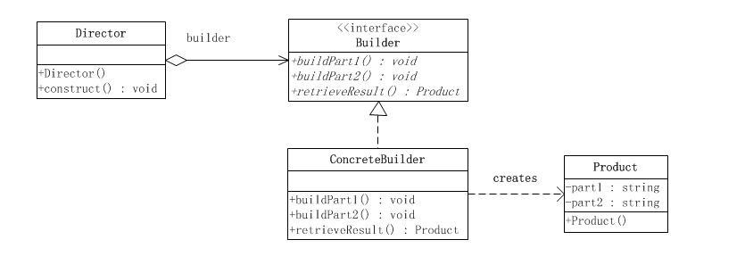

#《JAVA与模式》之建造模式
[《JAVA与模式》之建造模式](http://www.cnblogs.com/java-my-life/archive/2012/04/07/2433939.html)

建造模式是对象的创建模式。建造模式可以将一个产品的内部表象（internal representation）与产品的生产过程分割开来，从而可以使一个建造过程生成具有不同的内部表象的产品对象。

