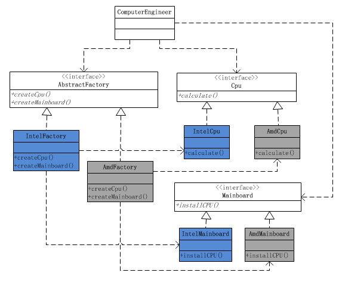

# 抽象工厂模式
参考
[《JAVA与模式》之抽象工厂模式](http://www.cnblogs.com/java-my-life/archive/2012/03/28/2418836.html)

对比简单工厂模式，抽象工厂模式通过抽象工厂对于产品进行匹配，不直接配对各个产品，针对接口编程而不是实现编程

通过增加memory类，实现了抽象工厂与简单工厂的结合

平台有关的使用抽象工厂模式
平台无关的使用简单工厂模式